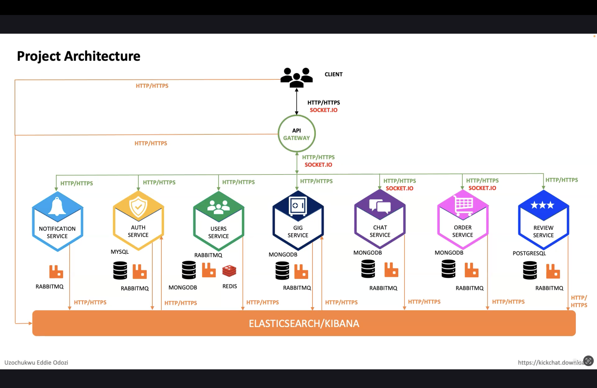

# Freelance Marketplace - Functional Requirements

## 🧑‍💼 User Authentication
- Users can create accounts (sign up as buyer or seller)
- Users can log in with email and password
- Password reset functionality via email

## 👤 User Profiles
- Users can create and edit their personal profile
- Sellers can create a seller profile with:
  - Description
  - Skills
  - Portfolio (optional)
  - Profile picture

## 🔍 Search and Filters
- Buyers can search for gigs by:
  - Keyword
  - Category
  - Price range
  - Delivery time
  - Ratings

## 💬 Messaging System
- Buyers can message sellers
- Sellers can reply to buyer messages
- Notifications for new messages

## ⭐ Rating and Reviews
- Buyers can rate and review sellers after an order is completed
- Sellers can rate and review buyers
- Reviews are visible on user profiles

## 💳 Payment Gateway Integration
- Buyers can pay for gigs using secure payment gateways (e.g., Stripe or Razorpay)
- Payment held in escrow until order is marked complete
- Refund/cancellation support

## 📦 Orders Management
- Buyers and Sellers can view:
  - Active Orders
  - Completed Orders
  - Cancelled Orders
- Each order shows status, timeline, messages, and deliverables

## ❌ Cancellation of Orders
- Buyers or Sellers can request order cancellation
- Admin/moderation support for dispute resolution (future scope)

---

# Freelance Marketplace - Non-Functional Requirements

## ⚙️ Scalability
- The system should be able to scale to accommodate increased load during peak times.
- Infrastructure should support horizontal scaling (e.g., via load balancers or container orchestration).

## 📶 Availability
- The system should maintain **99.99% uptime**.
- A failover mechanism must be implemented to ensure high availability during server or service failures.

## 🔁 Reliability
- The system should be dependable and consistently perform as expected under defined conditions.
- Data consistency and transactional integrity must be maintained, especially in payment and order modules.

## 🛠️ Maintainability
- Codebase must follow industry-standard best practices.
- Source code should be:
  - Modular and clean
  - Well-documented
  - Version-controlled (e.g., Git)
- Regular:
  - Code reviews
  - Automated testing (unit, integration, and end-to-end)
  - Continuous integration/deployment (CI/CD)

## 🧑‍💻 Usability
- User interface should be intuitive and user-friendly.
- Minimal training should be required for both buyers and sellers.
- Responsive design should ensure usability across devices (mobile, tablet, desktop).

---

# Freelance Marketplace - Design Decisions

## 🔐 API Gateway-Centric Architecture
- ❌ No direct client-to-microservice communication is allowed.
- ✅ All client requests **must pass through the API Gateway**.

## 🔗 Communication Between Layers
- The communication between the **API Gateway and microservices** will use:
  - **HTTP-based REST APIs**
  - **Socket.io** for real-time communication (e.g., messaging)

## 📡 Inter-Microservice Communication
- Microservices will **not** use HTTP to talk to each other.
- All inter-process communication will be **event-driven** (e.g., via a message broker like RabbitMQ, Kafka, or Redis pub/sub).

## 🔐 Authentication & Token Management
- **API Gateway** is responsible for:
  - Generating access tokens (e.g., JWT)
  - Validating tokens on every request
- All internal microservice requests will carry the user token for validation.

## 🌐 Access Control
- Only the **API Gateway** will be **exposed to the public/internet**.
- All other microservices will be **private and protected** within the network.

## 📦 Error Handling Strategy
- Client-related errors (e.g., invalid input) will be returned to the client via the **API Gateway**.
- All other errors (e.g., server crashes, timeouts) will be sent to a **centralized monitoring and logging system** (e.g., Sentry, Datadog, ELK Stack).

---

# Project Architecture

## 🔧 Overview

This architecture diagram represents a **Freelance Marketplace** built using a **microservices-based architecture** with a centralized **API Gateway**.

---

## 🧱 Key Design Points

- ✅ **No direct client-to-microservice communication**: All client requests go through the **API Gateway**.
- 🧠 **API Gateway** handles:
  - Token generation & verification
  - Forwarding requests to microservices (HTTP/HTTPS or Socket.io)
- 🔗 **Microservices** communicate with each other via **event-driven messaging** using **RabbitMQ**, not HTTP.
- 🔒 Only the API Gateway is **publicly accessible**; other services are isolated in a secure network.
- 🧪 Errors are:
  - Client errors → returned via API Gateway
  - System errors → logged in **Elasticsearch/Kibana**

---

## 🧩 Microservices Breakdown

| Microservice        | Database    | Message Broker | Notes                                 |
|---------------------|-------------|----------------|----------------------------------------|
| **Auth Service**     | MySQL       | RabbitMQ       | Handles login, signup, JWT tokens      |
| **Users Service**    | MongoDB     | RabbitMQ, Redis| Manages user data and caching          |
| **Gig Service**      | MongoDB     | RabbitMQ       | Manages gigs posted by sellers         |
| **Chat Service**     | MongoDB     | RabbitMQ       | Real-time messaging using Socket.io    |
| **Order Service**    | MongoDB     | RabbitMQ       | Manages gig orders                     |
| **Review Service**   | PostgreSQL  | RabbitMQ       | Handles reviews & ratings              |
| **Notification Service** | N/A   | RabbitMQ       | Sends notifications to users           |

---

## 📊 Monitoring & Logging

- All microservices send logs and errors to **Elasticsearch + Kibana** for centralized monitoring.
- **Elasticsearch** is a storage 
- **Kibana** is a deashboard

---

## 🎯 Communication Protocols

- API Gateway ↔ Microservices: **HTTP/HTTPS + Socket.io**
- Microservices ↔ Microservices: **RabbitMQ (Event-driven)**

---

## 🖼️ Architecture Diagram

